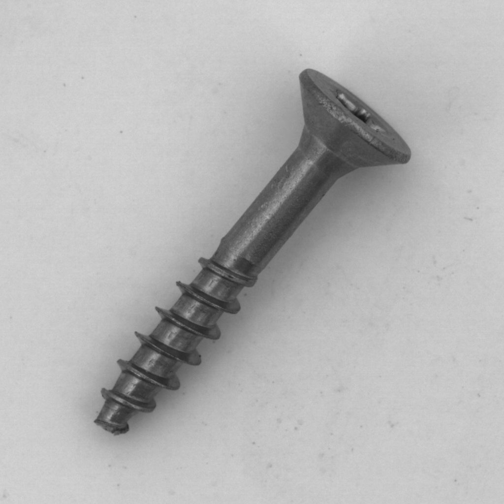
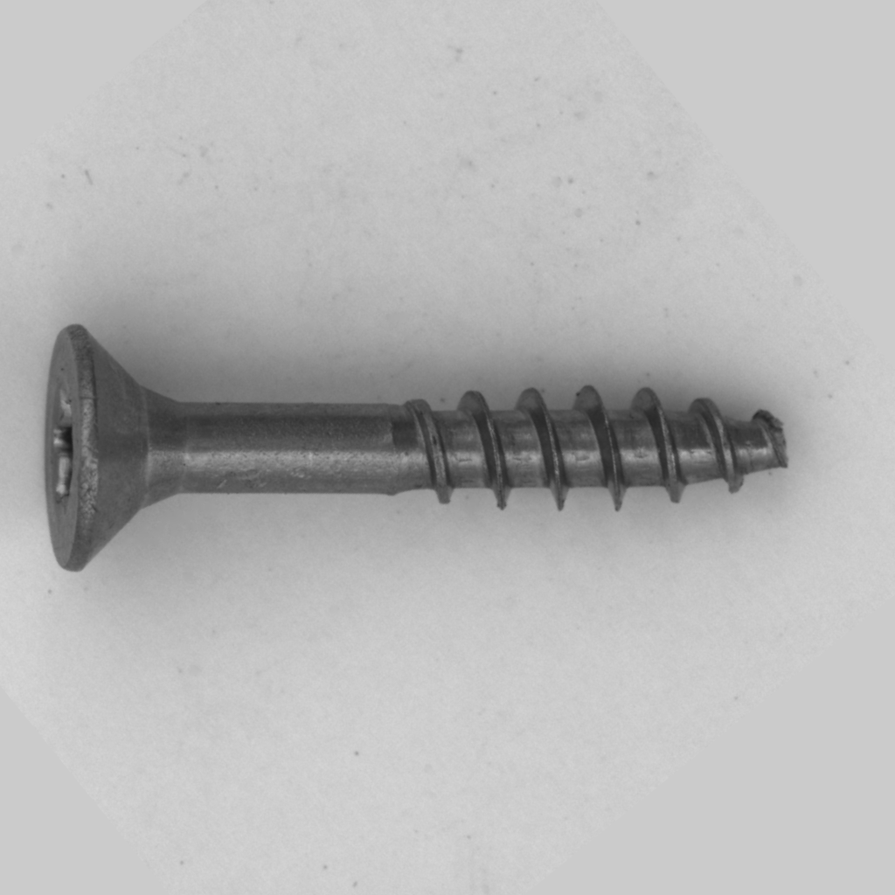
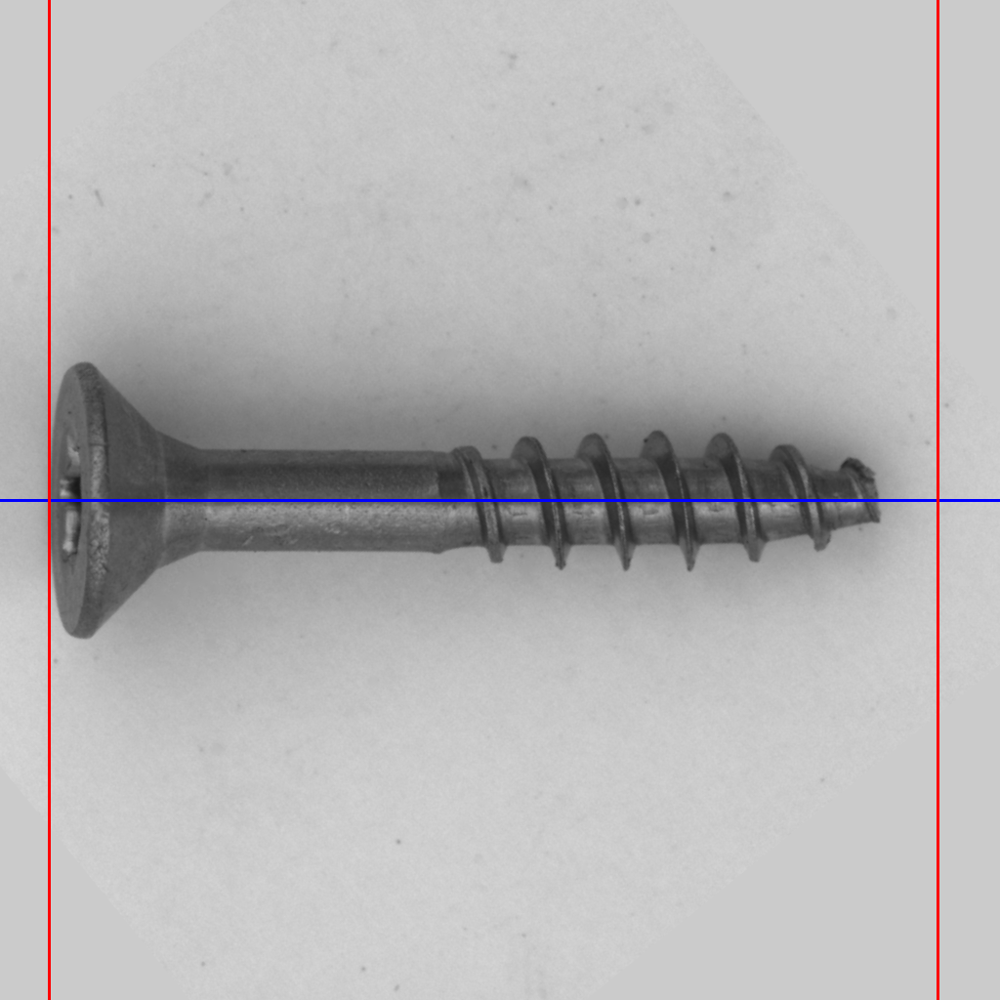

# Screw Anomaly Classification Project

This project aims to classify screws into categories: "good screws" and "defective screws".

## Dataset Introduction

The dataset used for this project is the MVTec Screws dataset, which is designed for anomaly detection. Some samples are labeled as "good items," while others are labeled as "anomalous items."

- Dataset link: [MVTec Screws Dataset](https://drive.google.com/file/d/11ozVs6zByFjs9viD3VIIP6qKFgjZwv9E/view?usp=sharing)

The dataset contains the following directories:

- `train/good/`: Training samples of good screws.
- `train/not-good/`: Training samples of anomalous screws.
- `test/`: Test images.

## Quick Start

### 1. Install Dependencies

```bash
pip install -r requirements.txt
```

### 2. Download and Prepare Data

Run the following script to automatically download and extract the dataset:

```bash
python download_mvtec_screws.py
```

### 3. Data Enhancement

The enhancement process is divided into two steps:

#### Step 1: Screw Alignment

We provide a script, `screw_alignment.py`, located in the `Data_enhancement` directory. This script will align the screws in the dataset. If the `draw_line` flag is set to `true`, it can draw the standard auxiliary lines on the images. However, it's recommended not to draw these lines during enhancement. The alignment details will be saved in `start_positions.pkl` for further use in enhancement. The aligned images will be saved in the `./archive-align` directory.

```bash
python Data_enhancement/screw_alignment.py --old ../archive --align ../archive-align --draw_line
```

Below are the comparison images before and after alignment:

|  |  |  |
|:---:|:---:|:---:|
| Original Image | Aligned Image | Aligned Image with Auxiliary Line |

#### Step 2: Image Enhancement

We provide another script, `enhance_dataset.py`, that enhances the images, making defects more pronounced. The enhanced images will be saved in the `./archive-enhance` directory.

```bash
python enhance_dataset.py
```

Below are the comparison images before and after enhancement:

|  |  |
|:---:|:---:|
| Original Image | Enhanced Image |

### 4. Train the Model

Start training using the following command:

```bash
python train_classifier.py --good_root ./archive-diff/train/good --not_good_root ./archive-diff/train/not-good --test_good_root ./archive-diff/test/good --test_not_good_root ./archive-diff/test/not-good --batch_size 100 --epochs 200 --learning_rate 5e-5 --train_split 0.8 --val_split 0.2
```

### 5. Monitor Training Process

You can monitor the training progress using TensorBoard. Logs are saved under the `runs` directory.

```bash
tensorboard --logdir runs
```

### 6. Test the Model

Use the `test_classifier.py` script for testing. Test labels are saved in `test_label.csv`, and the script will output predicted results in `test_result.csv`, along with `roc_auc_score` and `f1` scores.

```bash
python test_classifier.py
```
